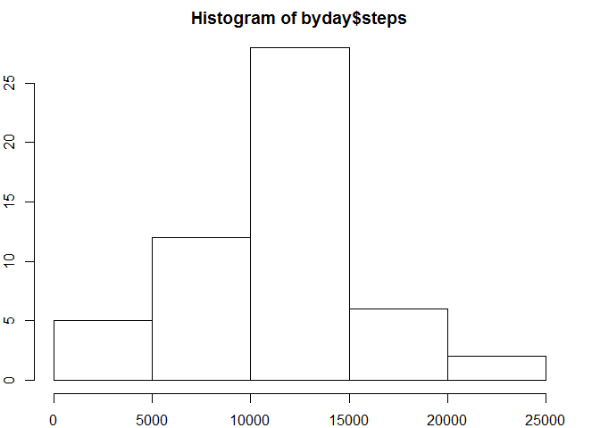
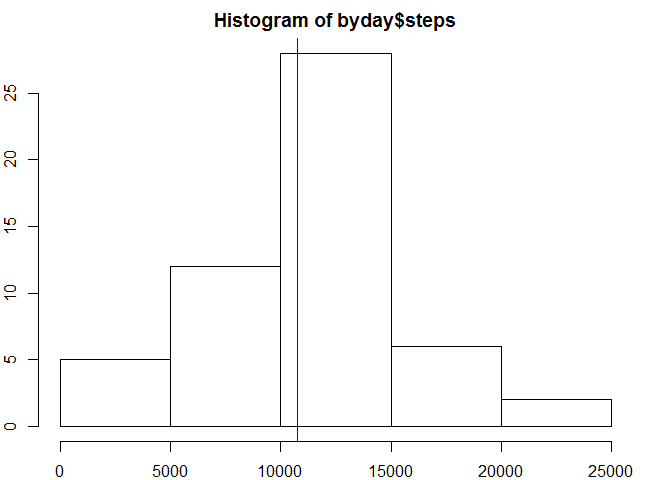
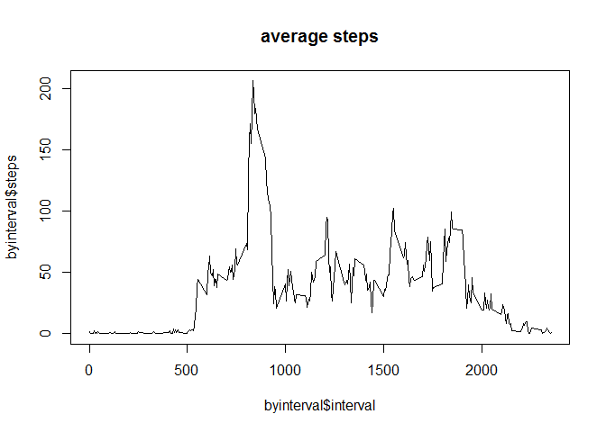
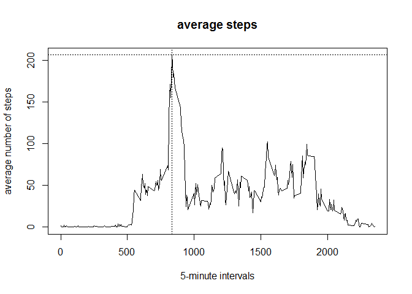
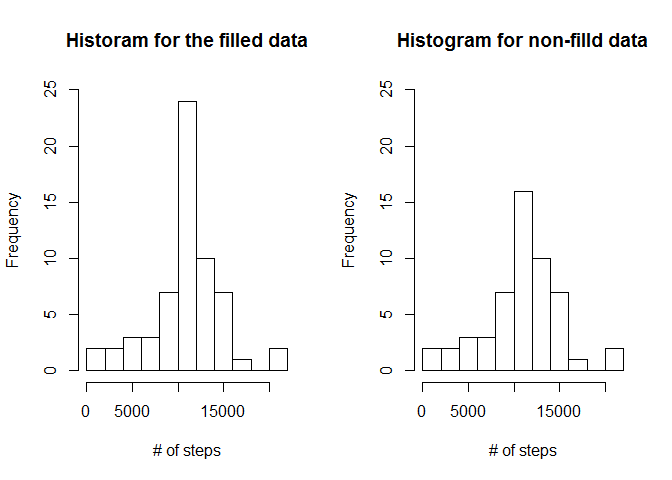
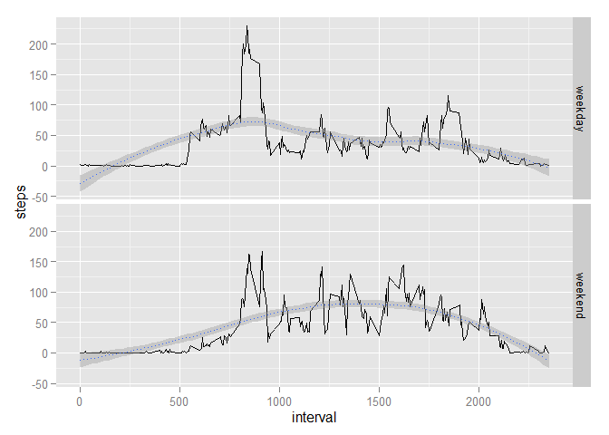

# Reproducible Research: Peer Assessment 1
Jijiki  
December 12, 2015  


Here are all the packages that will be used:

```r
library(knitr)
library(dplyr)
library(reshape2)
library(chron)
library(ggplot2)
```

## Loading and preprocessing the data

Before reading the data it is essential to unzip it.
The data set read is stored under the data frame 'activity'.


```r
unzip("activity.zip")
activity <- read.csv("activity.csv",header = T)
```

Here some quick exploration to see if there is a need for data cleaning (beside empty values that will be cleaned later).


```r
# exploration
head(arrange(activity,desc(steps)))
```

```
##   steps       date interval
## 1   806 2012-11-27      615
## 2   802 2012-10-12      900
## 3   794 2012-11-27      550
## 4   789 2012-11-19      720
## 5   786 2012-10-15      835
## 6   785 2012-11-05      925
```

```r
str(activity)
```

```
## 'data.frame':	17568 obs. of  3 variables:
##  $ steps   : int  NA NA NA NA NA NA NA NA NA NA ...
##  $ date    : Factor w/ 61 levels "2012-10-01","2012-10-02",..: 1 1 1 1 1 1 1 1 1 1 ...
##  $ interval: int  0 5 10 15 20 25 30 35 40 45 ...
```

```r
summary(activity)
```

```
##      steps                date          interval     
##  Min.   :  0.00   2012-10-01:  288   Min.   :   0.0  
##  1st Qu.:  0.00   2012-10-02:  288   1st Qu.: 588.8  
##  Median :  0.00   2012-10-03:  288   Median :1177.5  
##  Mean   : 37.38   2012-10-04:  288   Mean   :1177.5  
##  3rd Qu.: 12.00   2012-10-05:  288   3rd Qu.:1766.2  
##  Max.   :806.00   2012-10-06:  288   Max.   :2355.0  
##  NA's   :2304     (Other)   :15840
```

```r
head(table(activity$interval));tail(table(activity$interval))
```

```
## 
##  0  5 10 15 20 25 
## 61 61 61 61 61 61
```

```
## 
## 2330 2335 2340 2345 2350 2355 
##   61   61   61   61   61   61
```

## What is mean total number of steps taken per day?

Calculate the total number of steps taken per day


```r
byday <- aggregate(formula = steps ~ date,data = activity,FUN = sum)
```

Make a histogram of the total number of steps taken each day


```r
# histogram
par(mar = rep(2,4),mfrow = c(1,1))
hist(byday$steps)
```

 

Calculate and report the mean and median of the total number of steps taken per day


```r
# total mean and median per day
mean(byday$steps)
```

```
## [1] 10766.19
```

```r
median(byday$steps)
```

```
## [1] 10765
```


```r
# histogram
par(mar = rep(2,4),mfrow = c(1,1))
hist(byday$steps)
abline(v=c(mean(byday$steps),median(byday$steps)),col=c("red","blue"))
```

 
We only see 1 line as the second gets hidden behind - indeed, as we saw earlier, mean and median have mvery close values.

## What is the average daily activity pattern?

Make a time series plot (i.e. type = "l") of the 5-minute interval (x-axis) and the average number of steps taken, averaged across all days (y-axis)


```r
# time series of average
byinterval <- aggregate(formula = steps ~ interval,data = activity,FUN = mean,na.action = na.omit)
head(byinterval)
```

```
##   interval     steps
## 1        0 1.7169811
## 2        5 0.3396226
## 3       10 0.1320755
## 4       15 0.1509434
## 5       20 0.0754717
## 6       25 2.0943396
```

```r
plot(byinterval$interval,byinterval$steps,type = "l",main = "average steps")
```

 

Which 5-minute interval, on average across all the days in the dataset, contains the maximum number of steps?


```r
# interval with the highest steps averaged over days 
maxsteps <- max(byinterval$steps)
maxsteps
```

```
## [1] 206.1698
```

```r
byinterval[byinterval$steps==maxsteps,1]
```

```
## [1] 835
```

```r
plot(byinterval$interval,byinterval$steps,type = "l",main = "average steps",xlab = "5-minute intervals", ylab = "average number of steps")
abline(v=byinterval[byinterval$steps==maxsteps,1],h=maxsteps,lty = 3)
```

 

## Imputing missing values

Calculate and report the total number of missing values in the dataset (i.e. the total number of rows with NAs)


```r
# missing values
sum(!complete.cases(activity))
```

```
## [1] 2304
```

Devise a strategy for filling in all of the missing values in the dataset. The strategy does not need to be sophisticated. For example, you could use the mean/median for that day, or the mean for that 5-minute interval, etc.

The strategy is to fill the data with the average number of steps for the given interval across the entire dataset

```r
f <- function(interval) {
	byinterval[byinterval$interval==interval,]$steps
}
```
Create a new dataset that is equal to the original dataset but with the missing data filled in.

```r
activity_fill <- activity
for (i in 1:length(activity_fill$steps)) {
	if (is.na(activity_fill[i,1])) activity_fill[i,1] <- f(activity_fill[i,3])
}
head(activity_fill)
```

```
##       steps       date interval
## 1 1.7169811 2012-10-01        0
## 2 0.3396226 2012-10-01        5
## 3 0.1320755 2012-10-01       10
## 4 0.1509434 2012-10-01       15
## 5 0.0754717 2012-10-01       20
## 6 2.0943396 2012-10-01       25
```

```r
summary(activity_fill)
```

```
##      steps                date          interval     
##  Min.   :  0.00   2012-10-01:  288   Min.   :   0.0  
##  1st Qu.:  0.00   2012-10-02:  288   1st Qu.: 588.8  
##  Median :  0.00   2012-10-03:  288   Median :1177.5  
##  Mean   : 37.38   2012-10-04:  288   Mean   :1177.5  
##  3rd Qu.: 27.00   2012-10-05:  288   3rd Qu.:1766.2  
##  Max.   :806.00   2012-10-06:  288   Max.   :2355.0  
##                   (Other)   :15840
```

Make a histogram of the total number of steps taken each day and Calculate and report the mean and median total number of steps taken per day. Do these values differ from the estimates from the first part of the assignment? 

```r
# histograms
byday_fill <- aggregate(formula = steps ~ date,data = activity_fill,FUN = sum)
par(mfrow = c(1,2))
hist(byday_fill$steps,breaks = 10, main = "Historam for the filled data",xlab = "# of steps",ylim = c(0,25))
hist(byday$steps,breaks = 10, main = "Histogram for non-filld data",xlab = "# of steps",ylim = c(0,25))
```

 
What is the impact of imputing missing data on the estimates of the total daily number of steps?

```r
# total mean and median per day on filled data set
mean(byday_fill$steps)
median(byday_fill$steps)
```

```
## [1] 10766.19
## [1] 10766.19
```

```r
# total mean and median per day
mean(byday$steps)
median(byday$steps)
```

```
## [1] 10766.19
## [1] 10765
```
The mean doesn't change, but the median goes up, and becomes equal to the mean.
The median goes up, but a small proportion, as I filled data with means of the same interval and most probably many NA's are zeros, on time intervals where one doesn't walk much (at night, cf the 2 ends of the interval range)

## Are there differences in activity patterns between weekdays and weekends?

Create a new factor variable in the dataset with two levels - "weekday" and "weekend" indicating whether a given date is a weekday or weekend day.

```r
# add weekdays and weekend factor variable
activity_fill$date <- as.Date(activity_fill$date, format="%Y-%m-%d")
activity_fill <- mutate(activity_fill,day = weekdays(date))
activity_fill <- mutate(activity_fill,daytype = is.weekend(date))
activity_fill$daytype <- factor(activity_fill$daytype, labels = c("weekday","weekend"))

str(activity_fill)#(activity_fill[activity_fill$day=="Saturday",])
```

```
## 'data.frame':	17568 obs. of  5 variables:
##  $ steps   : num  1.717 0.3396 0.1321 0.1509 0.0755 ...
##  $ date    : Date, format: "2012-10-01" "2012-10-01" ...
##  $ interval: int  0 5 10 15 20 25 30 35 40 45 ...
##  $ day     : chr  "Monday" "Monday" "Monday" "Monday" ...
##  $ daytype : Factor w/ 2 levels "weekday","weekend": 1 1 1 1 1 1 1 1 1 1 ...
```

Make a panel plot containing a time series plot (i.e. type = "l") of the 5-minute interval (x-axis) and the average number of steps taken, averaged across all weekday days or weekend days (y-axis). See the README file in the GitHub repository to see an example of what this plot should look like using simulated data.


```r
# by interval split by weekday/weekend day
byinterval_fill <- aggregate(formula = steps ~ interval + daytype,data = activity_fill,FUN = mean,na.action = na.omit)
head(byinterval_fill)
```

```
##   interval daytype      steps
## 1        0 weekday 2.25115304
## 2        5 weekday 0.44528302
## 3       10 weekday 0.17316562
## 4       15 weekday 0.19790356
## 5       20 weekday 0.09895178
## 6       25 weekday 1.59035639
```

```r
g <- ggplot(byinterval_fill, aes(interval,steps)) 
g <- g + facet_grid(daytype ~ .)
g <- g + geom_line() 
g <- g + geom_smooth(method="loess", lty = 3)
g
```

 

Weekdays show a strong pick of average steps per interval around the intervals 800-850, and then a much lower number of steps.
Weekends have a more regular spread of steps by interval.

